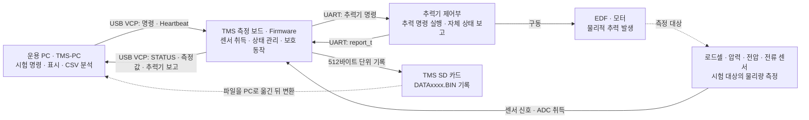
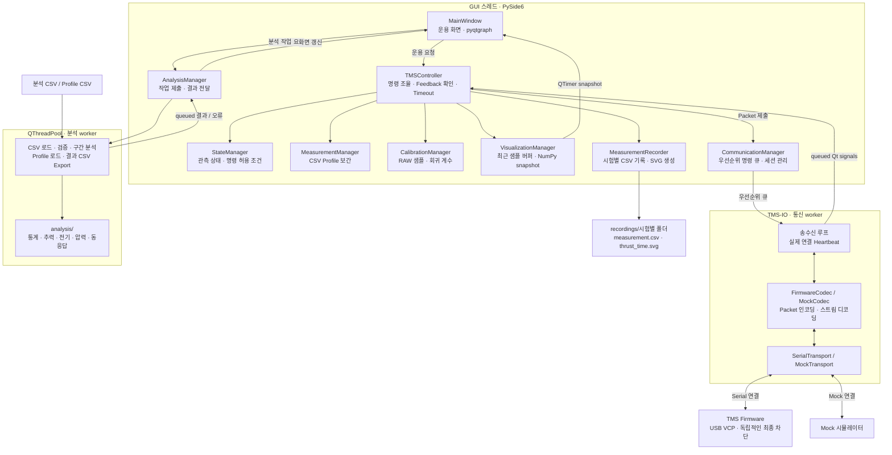

# TMS-PC

EDF(Electric Ducted Fan) 추력 측정 시스템의 PC 운용 및 CSV 분석 프로그램입니다. PySide6 GUI에서 센서 데이터를 확인하고 로드셀 보정, 추력 시험, 데이터 분석과 비교를 수행합니다.

Mock 시뮬레이터와 **TMS 펌웨어 USB VCP 연결**을 지원합니다. 펌웨어 규격은 [11_Rocket-Avionics-System의 추력 측정 보드](https://github.com/JseoPark/11_Rocket-Avionics-System/tree/bd60824d97615e68efa217bd90a9705edf5408e5/Rocket%20Avionics%20System%20-%20Thrust%20Measurement%20Board)에 맞췄습니다. 실제 장비 통합 검증은 아직 수행하지 않았습니다.

## 주요 기능

- Mock 연결과 실시간 전압·전류·추력·압력 그래프
- Feedback 기반 모드 전환 및 명령 상태 확인
- 다점 로드셀 Calibration과 회귀 계수 계산
- 고정 추력 명령 및 CSV Profile 시험
- CSV 검증, 구간 통계, 전력·에너지·동응답 분석과 파일 비교
- 처리 데이터·분석 결과 CSV 및 그래프 PNG 내보내기
- 별도 HardwareReport 모델과 72바이트 report_t payload 디코더

시뮬레이터는 실제 EDF 성능 모델이 아닙니다. PC는 안전 시스템이 아니며, 통신 상실 시 최종 모터 정지와 안전 모드 전환은 독립적인 TMS Firmware가 수행해야 합니다.

## 설치

Python **3.11 이상**이 필요합니다. 프로젝트 루트에서 실행합니다. 아래 명령은 Windows PowerShell 기준이며 가상 환경 활성화 없이 사용할 수 있습니다.

```powershell
python -m venv .venv
.\.venv\Scripts\python.exe -m pip install -r requirements.txt
```

requirements.txt는 프로젝트를 editable 모드로 설치하고 pytest와 PyInstaller도 설치합니다. 주요 런타임 의존성은 PySide6, pyqtgraph, pyserial, NumPy, pandas, SciPy입니다. 버전 범위는 [pyproject.toml](pyproject.toml)에 정의되어 있습니다.

## 실행

Mock 시뮬레이터에 자동 연결:

```powershell
.\.venv\Scripts\python.exe -m tms_pc.main --mock
```

GUI 실행 (`Run_TMS.cmd`를 더블클릭해도 됩니다):

```powershell
.\.venv\Scripts\python.exe -m tms_pc.main
```

`Refresh COM`으로 모든 COM 포트를 표시하고, 사용할 포트와 Baud를 선택한 뒤 `Connect`를 누릅니다. 실제 장비에는 자동 연결하지 않습니다.

설치된 CLI 진입점도 사용할 수 있습니다.

```powershell
.\.venv\Scripts\tms-pc.exe --mock
```

로그는 실행한 작업 디렉터리의 `logs/tms_pc.log`에 기록됩니다.

### 실제 TMS 연결

TMS USB VCP COM 포트를 선택하고 양의 정수 Baud를 입력한 뒤 `Connect`를 누릅니다. Baud 목록에는 `2000000`도 포함됩니다. Baud는 GUI/pySerial 설정이며 USB CDC 전송률을 정하지 않습니다. 추력기 UART의 2Mbps는 PC 링크 설정이 아닙니다.

Measurement 화면에 Enable 차단 원인이 표시됩니다. `SD` 오류는 카드 장착·파일시스템·쓰기 상태를 확인하고, 장치 오류를 해결한 뒤 `Enter MEASUREMENT`로 복구를 요청하세요. `Fault: NONE`과 모드 전환을 확인한 뒤 Enable 및 Start를 진행합니다.

PC는 136바이트 TMS report를 받아 상태, RAW 및 보정된 센서 값을 표시하며 worker에서 100ms 간격으로 Heartbeat를 전송합니다. 미보정 값은 N/A이며, 최신 추력기 보고의 battery_percent는 Thruster Battery (%)로 표시합니다. Start는 Enable Feedback과 500ms 이내 추력기 보고가 필요합니다. Stop은 펌웨어 ID 8을 사용해 Standby로 전환합니다.

실제 Calibration 취득은 Run Feedback 이후 Acquire를 요청합니다. 펌웨어에 계수 echo/ACK가 없어 실제 장비 Apply 버튼은 비활성화되어 있습니다. 종료 전 Stop Feedback을 확인하세요. 현재 창 종료/Disconnect는 확인된 Stop을 기다리지 않으며 최종 차단은 펌웨어 timeout에 의존합니다.

### 펌웨어 SD 파일 읽기

펌웨어 SD 로그는 DATAxxxx.BIN의 512바이트 기록입니다.

```powershell
.\.venv\Scripts\python.exe -m tms_pc.communication.firmware_log DATA0000.BIN extracted.csv
```

checksum·counter·runtime을 검증하고 미기록 tail을 제외합니다. 출력은 RAW/valid/calibrated/fault를 보존한 펌웨어 CSV이며, 압력 단위가 미확정이라 canonical 분석 CSV로 직접 사용할 수 없습니다.

## Mock 사용법

### 고정 추력 시험

1. Mock으로 실행하고 연결 상태와 센서 값이 갱신되는지 확인합니다.
2. Measurement 화면에서 Measurement 모드 진입을 요청하고 Feedback을 기다립니다.
3. `Enable Thrust`를 누른 뒤 `Start`를 누릅니다. 모드 진입, Enable, Start는 각각 별도 동작입니다.
4. `Throttle (%)`에 0~100% 스로틀 값을 입력하고 `Send Throttle Command`를 누릅니다. 명령은 Start Feedback 이후 적용합니다.
5. 종료 시 `Stop`을 누르고 상태를 확인한 뒤 Standby 모드로 전환합니다.

### CSV Profile 시험

Measurement 화면에서 `Load Profile CSV`로 [examples/thrust_profile.csv](examples/thrust_profile.csv)를 불러오고 `Use CSV Profile`을 선택합니다. 이후 Measurement 모드 진입 → Enable → Start 순서로 진행합니다. Profile 완료 시 Stop을 요청합니다.

```csv
time_s,thrust_percent
0,0
1,20
3,50
5,0
```

최소 두 행이 필요합니다. 시간은 음수가 아닌 값으로 엄격히 증가해야 하고 명령은 0~100% 범위여야 합니다. 첫 실행 telemetry를 기준으로 상대 시간을 계산하며 기본 보간은 선형입니다.

### 로드셀 Calibration

Calibration 모드에서 기준 하중(N)을 입력하고 샘플 수집을 시작·종료한 뒤 보정점을 추가합니다. 여러 기준 하중에서 반복하고 `Calculate Regression`으로 계수를 계산합니다. Mock에서는 기준 하중을 시뮬레이션 입력으로 사용합니다. 실제 장비에는 RAW 샘플과 보정 계수 Feedback 규격이 필요합니다.

### CSV 분석 및 내보내기

1. Analysis 화면의 `Load CSV Files`로 [examples/sample_log.csv](examples/sample_log.csv) 또는 분석할 파일들을 선택합니다.
2. 검증 결과를 확인하고 분석 시작·종료 시간과 채널을 선택합니다.
3. `Analyze Range`로 분석합니다. `Align Start Time`은 비교 그래프 시간 정렬에만 적용됩니다.
4. `Export All Results CSV` 또는 `Export Graph PNG`로 저장합니다.

원본 CSV는 수정하지 않으며 원본 파일 덮어쓰기를 거부합니다. 예제는 시뮬레이터 데이터입니다.

## 데이터 형식

분석 CSV는 UTF-8 헤더와 아래 필수 컬럼을 사용합니다. 단위는 자동 변환하지 않습니다.

| 컬럼 | 단위 또는 값 |
|---|---|
| `runtime` | s, TMS 시간 |
| `thrust_command` | %, 적용된 명령 0~100 |
| `motor_voltage` | V |
| `motor_current` | A |
| `load_cell` | N, 보정된 추력 |
| `pressure` | kPa |
| `tms_mode` | 모드 enum 이름 |
| `thrust_enable` | 0 또는 1 |

선택 컬럼 `raw_load_cell`은 RAW 값, `thrust_reference_n`은 목표 추력(N)입니다. Tracking은 동일 단위의 목표 추력이 있을 때만 계산합니다. 명령(%)과 추력(N)을 직접 Tracking 오차로 비교하지 않습니다.

행 제외 규칙, 통계 정의 및 Export 형식은 [데이터 형식](docs/DATA_FORMAT.md)을 참조하세요.

## 아키텍처

### 전체 장비 구성과 역할

PC는 시험 조건을 지정하고 결과를 표시·분석합니다. TMS 측정 보드는 센서 취득, 운용 상태 관리, 추력기와의 통신 및 SD 기록을 담당합니다. 추력기 제어부는 TMS에서 받은 명령을 실행하고 자체 상태를 보고합니다. 아래 구성은 현재 프로젝트의 [펌웨어 연동 규격](docs/PROTOCOL.md)을 기준으로 하며, 실제 장비 통합 검증은 남아 있습니다.



| 장비 | 시스템에서 수행하는 역할 | 다른 장비와의 관계 |
|---|---|---|
| 운용 PC | 모드·Enable·Start·추력·Stop 요청, Profile 실행, 보정 계수 계산, 실시간 표시, 시험 CSV 저장과 사후 분석 | USB VCP로 TMS에 연결하며 TMS 보고를 통해 적용 상태를 확인합니다. |
| TMS 측정 보드 | RAW 센서 취득과 보정값 보고, 모드·운용 상태 관리, 추력기 명령 전달과 보고 수집, SD 기록 | PC와 추력기 사이에서 운용을 조율합니다. 펌웨어 규격상 PC/추력기 timeout 및 fault에 따른 독립적인 출력 차단과 Safe 전환을 담당합니다. |
| 추력기 제어부 | 추력 명령 실행 및 자체 telemetry 생성 | TMS와 USART1의 2Mbps 8N1 UART로 통신합니다. 72바이트 `report_t`는 TMS가 PC report에 포함해 전달합니다. 구동부 내부 구현은 이 저장소의 범위 밖입니다. |
| EDF·모터 및 구동부 | 명령에 따른 물리적 추력 발생 | 발생한 추력과 전기·압력 특성을 센서로 측정합니다. PC의 명령 %와 로드셀 측정 N은 서로 다른 값입니다. |
| 로드셀·압력·전압·전류 센서 | 추력 및 시험 중 물리량을 센서 신호로 제공 | TMS가 ADC로 취득합니다. PC는 RAW/valid/calibrated 상태를 구분해 표시하며, 실제 압력 단위와 아날로그 변환 상수는 추가 확인이 필요합니다. |
| TMS SD 카드 | 보드 측 시험 보고를 `DATAxxxx.BIN`으로 보존 | PC의 `measurement.csv`와 별도 저장 경로입니다. 파일을 PC로 옮긴 뒤 `firmware_log`로 변환하며, 분석용 CSV로 사용하려면 단위와 보정 상태를 확인해야 합니다. |

보정에서는 PC가 기준 하중과 RAW 샘플로 계수를 계산하고 TMS가 센서 변환을 수행합니다. 현재 실제 장비는 계수 echo/ACK가 없어 PC의 Apply 기능을 비활성화합니다. PC 측 CSV 기록과 TMS 측 SD 기록은 각각의 수신·취득 경로에 기반하므로 동일한 샘플 수를 보장하지 않습니다.

### PC 소프트웨어 구성

`main.py`가 QApplication, `TMSController`, `MainWindow`를 생성합니다. 실시간 장비 운용은 Controller를 중심으로 구성하며, 파일 분석은 MainWindow가 소유한 `AnalysisManager`를 통해 별도 실행합니다.



### 모듈별 역할

| 구성 요소 | 책임 | 구현 |
|---|---|---|
| MainWindow | 연결·보정·시험·분석 화면, 주기적 그래프 갱신 | [gui/main_window.py](src/tms_pc/gui/main_window.py) |
| TMSController | 운용 요청 조율, 명령별 기대 상태와 deadline, Stop 처리 | [controller.py](src/tms_pc/controller.py) |
| StateManager | 수신 STATUS 반영, 모드별 명령 허용 조건 검사 | [state_manager.py](src/tms_pc/managers/state_manager.py) |
| MeasurementManager / CalibrationManager | telemetry 시간 기반 Profile 실행, 보정 샘플 관리와 회귀 계산 | [measurement_manager.py](src/tms_pc/managers/measurement_manager.py) · [calibration_manager.py](src/tms_pc/managers/calibration_manager.py) |
| CommunicationManager | I/O worker 실행, 명령 큐 취소·우선순위, 연결 세션 구분 | [communication_manager.py](src/tms_pc/managers/communication_manager.py) |
| Codec / Transport | 논리 Packet과 전송 바이트 변환, Serial 또는 Mock 송수신 | [communication/](src/tms_pc/communication/) |
| VisualizationManager / MeasurementRecorder | 상한이 있는 실시간 버퍼, 버퍼와 독립적인 시험 기록 | [visualization_manager.py](src/tms_pc/managers/visualization_manager.py) · [measurement_recorder.py](src/tms_pc/managers/measurement_recorder.py) |
| AnalysisManager / analysis | worker 작업 관리, CSV 검증·분석과 결과 Export | [analysis_manager.py](src/tms_pc/managers/analysis_manager.py) · [analysis/](src/tms_pc/analysis/) |
| models / config | 상태·telemetry·report·Profile 모델, PC/Mock 설정 | [models/](src/tms_pc/models/) · [settings.py](src/tms_pc/config/settings.py) |

### 명령과 데이터 흐름

1. **명령 송신:** GUI 요청 → Controller의 상태·유효성 검사 → 논리 Packet → 우선순위 큐 → 통신 worker → Codec → Transport 순서입니다. Transport의 연결·읽기·쓰기·종료는 I/O worker가 수행합니다.
2. **응답 확인:** 수신 바이트를 Codec이 디코딩하고, worker가 queued Qt signal로 Controller에 전달합니다. 실제 TMS report는 Controller에서 STATUS와 TELEMETRY로 나눠 처리합니다. 전송 완료 이후 관측 상태가 명령의 기대 값과 일치해야 Feedback 완료로 판단합니다.
3. **실시간 표시와 기록:** telemetry는 시각화 버퍼, 시험 기록, 보정 샘플 또는 Profile 실행에 전달됩니다. GUI는 기본 100ms마다 snapshot으로 그래프를 갱신합니다. Measurement Start 요청 시 기록을 열고 수신 샘플을 CSV에 저장하며, 기록 종료 시 `thrust_time.svg`를 생성합니다. 저장 위치와 컬럼은 [시험 기록 문서](docs/MEASUREMENT_RECORDING.md)를 참조하세요.
4. **파일 분석:** GUI → AnalysisManager → QThreadPool 작업에서 CSV 검증·선택 구간 분석·CSV Export를 수행하고 결과를 GUI 스레드로 전달합니다. 그래프 PNG Export와 시험 기록의 CSV 쓰기·종료 SVG 생성은 현재 GUI 스레드에서 수행합니다.

### 스레드와 운용 경계

- GUI 스레드에서 상태 모델과 화면을 관리하며, Controller는 20ms QTimer로 명령 deadline과 상태 timeout을 검사합니다. 통신과 분석 worker의 결과는 queued signal로 전달합니다.
- 명령 큐의 generation으로 취소된 미전송 명령을 폐기하고, PC 내부 session ID로 이전 연결의 늦은 이벤트를 무시합니다. 실제 펌웨어 응답에는 명령 correlation ID가 없어 현재 관측 상태로 완료를 판단합니다.
- 실제 연결은 FirmwareCodec과 SerialTransport, Mock 연결은 MockCodec과 MockTransport를 사용합니다. 실제 연결 Heartbeat는 I/O worker에서 기본 100ms마다 전송합니다.
- Stop은 큐와 Profile 실행을 취소하고 높은 우선순위로 처리합니다. 실제 장비는 펌웨어 ID 8로 Standby 전환을 요청하며, Mock은 0% → disable → run false를 순서대로 확인합니다. 비상 정지는 SAFE 전환을 요청합니다. 통신 상실 시 최종 차단은 TMS Firmware가 담당합니다.

상세 프로토콜과 상태 전이는 [PROTOCOL](docs/PROTOCOL.md), [STATE_MACHINE](docs/STATE_MACHINE.md), [SAFETY](docs/SAFETY.md)를 참조하세요.

## 프로젝트 구조와 설정

```text
src/tms_pc/
  main.py          실행 진입점
  controller.py    운용 흐름과 명령 처리
  gui/             PySide6 화면
  managers/        상태·통신·보정·시험·분석 관리
  communication/   Serial/Mock transport와 디코더
  analysis/        검증·통계·추력·전기·압력·동응답 분석
  models/          상태 및 데이터 모델
  config/          PC/시뮬레이터 설정
  utils/           로깅
docs/              설계 및 검증 문서
tests/             자동 테스트
examples/          분석 및 Profile 예제 CSV
scripts/           Mock 실행 및 예제 생성 보조 스크립트
```

Timeout, GUI 갱신 주기, 버퍼 및 보정 샘플 상한은 [settings.py](src/tms_pc/config/settings.py)에서 관리합니다. PC/Mock 설정이며 펌웨어 기본값을 의미하지 않습니다.

상단 `Baud (bit/s)`에서 양의 정수 값을 선택하거나 직접 입력할 수 있습니다. 연결 중 변경은 잠기고 Mock에서는 사용하지 않습니다. USB VCP와 추력기 UART의 전송 설정은 서로 다릅니다.

## 검증

```powershell
.\.venv\Scripts\python.exe -m pytest -q
```

테스트에는 Mock 시험, Profile 완료, 통신 상실, Feedback timeout, 재연결, Calibration, CSV 분석, report 디코더, Serial loopback 및 Qt GUI 동작이 포함됩니다. GUI 테스트는 offscreen 환경에서 실행됩니다.

자동 종료를 포함한 GUI 실행 점검:

```powershell
.\.venv\Scripts\python.exe -m tms_pc.main --mock --smoke-seconds 3
```

기존 검증 기록에는 2026-10-03 Python 3.13.5에서 42개 pytest 통과가 기록되어 있습니다. 상세 이력은 [TODO](docs/TODO.md)를 참조하세요. 자동 테스트 통과는 실제 하드웨어 운용 준비 완료를 의미하지 않습니다. 직접 GUI 조작과 실제 장비 통합 검증은 별도 단계입니다.

## 실행 파일 빌드

프로젝트 루트에서 실행합니다.

```powershell
.\.venv\Scripts\python.exe -m PyInstaller --noconfirm --windowed --name TMS-PC --paths src src/tms_pc/main.py
```

기본 출력 위치는 `dist/TMS-PC/`입니다. 패키징 빌드와 배포 환경 실행 검증은 남은 작업입니다.

## 현재 제한

실제 PC 링크는 AB/00 00 + payload + uint32 byte-sum이며 little endian입니다. 송신 명령은 32바이트, 수신 report는 136바이트입니다. 72바이트 report_t는 TMS report 내부의 추력기 데이터입니다. 상세 규격은 [PROTOCOL](docs/PROTOCOL.md)을 참조하세요.

펌웨어 보정 계수 echo/ACK, 명령 응답 correlation, 압력 단위와 아날로그 변환 상수 및 추력기 필드 의미는 추가 확인이 필요합니다. 실제 장비 운용과 패키징 검증은 미완료입니다.

자동 동응답 분석은 구간 내 대표 명령 변화 하나를 분석합니다. 여러 step 자동 분할은 미구현입니다. PNG Export 렌더링은 현재 GUI 스레드에서 수행합니다.

## 관련 문서

- [요구사항](docs/REQUIREMENTS.md) · [아키텍처](docs/ARCHITECTURE.md)
- [상태 머신](docs/STATE_MACHINE.md) · [GUI 설계](docs/GUI_DESIGN.md)
- [통신 프로토콜과 report_t](docs/PROTOCOL.md) · [안전 설계](docs/SAFETY.md)
- [데이터 형식](docs/DATA_FORMAT.md) · [테스트 계획](docs/TEST_PLAN.md)
- [검토한 공식 자료](docs/REFERENCES.md) · [진행 상태와 남은 작업](docs/TODO.md)
